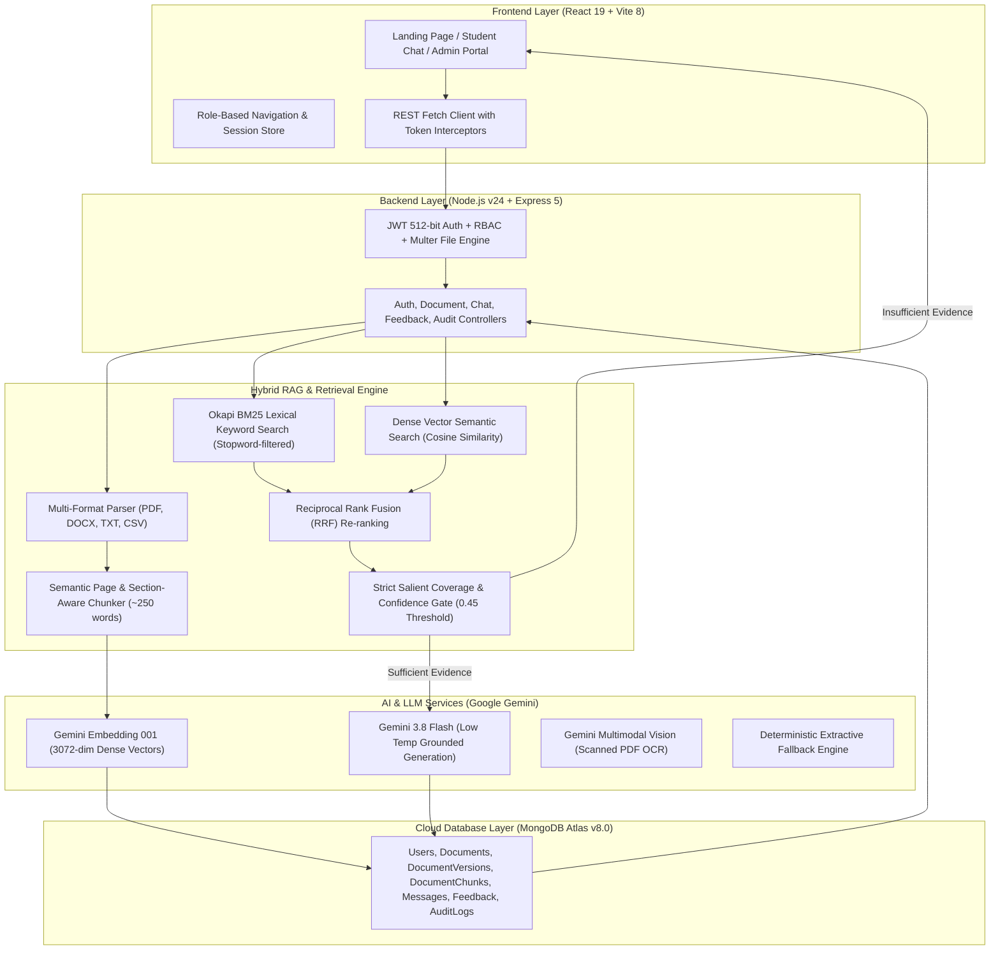

# 🎓 CampusAI (EDU-02) — Complete Technical Stack & Architecture Dossier

> **Project:** EDU-02 — Campus Knowledge Copilot  
> **Core Operating Principle:** *"No Evidence → No Answer"*  
> **Architecture Paradigm:** Hybrid Retrieval-Augmented Generation (Dense Vectors + Okapi BM25 + Reciprocal Rank Fusion + Strict Abstention Gating)  
> **Target Environment:** Multi-tier College/University Knowledge Management  

---

## 📑 Table of Contents
1. [Executive Summary](#1-executive-summary)
2. [End-to-End System Architecture](#2-end-to-end-system-architecture)
3. [Technology Stack Matrix](#3-technology-stack-matrix)
4. [Hybrid RAG Retrieval Engine](#4-hybrid-rag-retrieval-engine)
5. [Multi-Format Ingestion & Gemini Vision OCR](#5-multi-format-ingestion--gemini-vision-ocr)
6. [Security, Cryptography & Role-Based Access Control](#6-security-cryptography--role-based-access-control)
7. [Database Schemas & Data Modeling](#7-database-schemas--data-modeling)
8. [Complete REST API Specification](#8-complete-rest-api-specification)
9. [Verification & Benchmark Scenarios](#9-verification--benchmark-scenarios)
10. [Step-by-Step Installation & Run Guide](#10-step-by-step-installation--run-guide)

---

## 1. Executive Summary

Higher education institutions face severe knowledge fragmentation. Regulations, examination rules, attendance policies, scholarship requirements, placement eligibility, and curricula are typically distributed across dozens of uncoordinated PDFs, scanned physical notices, DOCX files, and spreadsheets.

**CampusAI** provides an institution-grounded artificial intelligence copilot that:
- **Answers questions directly** from authenticated college regulations.
- **Provides deterministic citations**: document name, exact page number, section title, and confidence score.
- **Guarantees zero hallucinations**: enforces an explicit **"No Evidence → No Answer"** abstention protocol (*"Information not found in the institutional knowledge base"*).
- **Supports multi-format ingestion** (PDF, DOCX, TXT, CSV) including **scanned/image-only PDFs** via automated Gemini Multimodal Vision OCR.

---

## 2. End-to-End System Architecture



---

## 3. Technology Stack Matrix

### A. Frontend Layer

| Technology | Version | Purpose & Technical Function |
| :--- | :---: | :--- |
| **React** | `^19.2.8` | Component-driven UI library leveraging React 19 functional hooks (`useState`, `useEffect`, `useRef`, `useCallback`) for reactive state management. |
| **Vite** | `^8.3.3` | Next-generation build tool featuring native ES modules, lightning-fast Hot Module Replacement (HMR), and optimized tree-shaken asset bundles. |
| **React Router DOM** | `^7.18.4` | Client-side routing engine managing guarded routes (`/`, `/login`, `/register`, `/chat`, `/admin`) based on authentication tokens and user roles. |
| **Vanilla CSS** | — | Curated design system adhering to dark glassmorphism standards (`#000000`, `#08080a`, `#1c1c20`, `#555ce0`), backdrop-blur glass panels, and ambient glow effects. |
| **Lucide React** | `^1.16.0` | Accessible, tree-shakeable icon set for citation cards, upload dropzones, status badges, and feedback controls. |

### B. Backend Layer

| Technology | Version | Purpose & Technical Function |
| :--- | :---: | :--- |
| **Node.js** | `v24.13.0` | High-throughput, asynchronous event-driven JavaScript runtime executing server controllers, parser pipelines, and vector mathematics. |
| **Express.js** | `^5.2.1` | REST framework organizing routing tables, parameter validation, security middleware chains, and JSON body parsing. |
| **Multer** | `^2.4.0` | Streaming multipart/form-data handler with memory buffering and MIME type whitelisting (`.pdf`, `.docx`, `.txt`, `.csv`) up to 25MB. |
| **CORS** | `^2.8.6` | Cross-Origin Resource Sharing middleware facilitating secure communication between Vite client and Express server. |
| **Dotenv** | `^18.0.5` | Twelve-factor configuration loader reading environment variables from `.env`. |

### C. Artificial Intelligence & Vector Processing

| Model / Library | Provider / Engine | Purpose & Technical Function |
| :--- | :--- | :--- |
| **Gemini 3.8 Flash** | Google Generative AI | Foundation LLM providing factually constrained synthesis. Configured with low temperature (`0.1`) and system instructions strictly prohibiting external knowledge speculation. |
| **Gemini Embedding 001** | Google Generative AI | State-of-the-art 3072-dimensional vector embedding model for indexing document chunks and converting user queries into high-density semantic representations. |
| **Gemini Multimodal Vision** | Google Generative AI | Multimodal visual OCR engine invoked when an uploaded PDF contains 0 digital text characters (scanned images/handouts). |
| **Local Vectorizer Fallback** | Deterministic Math Engine | In-memory 256-dimensional L2-normalized dense vectorizer and extractive grounding engine ensuring uninterrupted local functionality during API rate limits or quota drops. |

### D. Persistence & Database

| Technology | Version | Purpose & Technical Function |
| :--- | :---: | :--- |
| **MongoDB Atlas** | Cloud v8.0 | High-availability cloud NoSQL document cluster persisting users, documents, versions, chunks, chat messages, and audit logs. |
| **Mongoose ODM** | `^9.11.0` | Object data modeling library enforcing strict schemas, type casting, validation rules, compound indexes, and pre-save password hashing. |

---

## 4. Hybrid RAG Retrieval Engine

CampusAI rejects naive vector-only similarity in favor of a 4-stage **Hybrid Retrieval Pipeline**:

```
User Query
   │
   ├── [Stage 1: Okapi BM25 Lexical Index] ──> Exact keyword & code matching (45% weight)
   │                                           - Stopword pruning (what, is, rule, college)
   │                                           - Term frequency saturation & length normalization
   │
   ├── [Stage 2: Dense Vector Semantic Search] ─> Cosine similarity over 3072-dim vectors (55% weight)
   │                                             - Dot product / (norm(q) * norm(d))
   │
   └── [Stage 3: Reciprocal Rank Fusion (RRF)] ─> Rank combination: Score = 0.55 * VecScore + 0.45 * BM25Score
                                                 - Section-match bonus (+0.08) for matching headings
                                                 - Deduplication across candidate chunks
   │
   └── [Stage 4: Evidence & Confidence Gate] ──> "No Evidence → No Answer" Check
                                                 - Salient keyword coverage evaluation
                                                 - If combined confidence < 0.45: ABSTAIN IMMEDIATELY
                                                 - If combined confidence >= 0.45: SEND TO GROUNDED GEMINI
```

### Prompt Guard System
The prompt sent to Gemini is strictly bounded:
```text
You are the official Campus Knowledge Copilot for this institution.
Answer the user's question using ONLY the provided verified institutional excerpts.

CRITICAL RULES:
1. "No Evidence -> No Answer": If the provided excerpts do not contain the answer, reply EXACTLY:
   "Information not found in the institutional knowledge base."
2. NEVER assume, invent, extrapolate, or use outside general knowledge.
3. Every factual claim MUST cite its source using: [Source: Document Name, Page X, Section Y].
4. Keep the answer clear, structured, and factual.
```

---

## 5. Multi-Format Ingestion & Gemini Vision OCR

| Format | Extraction Engine | Strategy |
| :--- | :--- | :--- |
| **PDF** | `pdf-parse ^2.4.5` | Page-by-page streaming text extraction preserving 1-to-1 physical page numbers. |
| **Scanned PDF** | **Gemini Multimodal Vision OCR** | Automatically triggered when `pdf-parse` extracts 0 characters. The raw buffer is converted to base64 `application/pdf` and sent to `gemini-3.8-flash` with the prompt: *"Transcribe all readable text from this document page by page... Preserve headers, tables, and dates exactly."* |
| **DOCX** | `mammoth ^1.13.0` | Native conversion of Word document paragraphs, headings, and lists into structured plain text. |
| **CSV** | `csv-parser ^3.2.1` | Row-by-row parsing with tabular headers converted into structured key-value statements. |
| **TXT** | Native UTF-8 Stream | Formatted plain text parsing with paragraph boundary detection. |

---

## 6. Security, Cryptography & Role-Based Access Control

1. **512-bit JWT Cryptography**: Session tokens signed with HMAC-SHA512 using a cryptographically secure 512-bit secret key.
2. **Bcrypt Password Salting**: 10 salt rounds executed via Mongoose pre-save middleware hooks (`bcryptjs ^3.0.3`).
3. **Role-Based Access Control (RBAC)**:
   - **Student**: Query copilot, view citations, inspect source excerpts, submit thumbs up/down feedback.
   - **Faculty**: Student privileges + view document index metadata.
   - **Admin**: Full authority — upload new institutional documents, trigger OCR re-processing, delete documents, and view grounding audit statistics.
4. **Key Rotation & Migration Resilience**: Dual-secret verification and email fallback in `auth.js` ensuring existing sessions remain active during secret rotation or database migration.

---

## 7. Database Schemas & Data Modeling

- **`User`**: `name`, `email` (unique, lowercase), `password` (bcrypt hash), `role` (`student`, `faculty`, `admin`), `department`, `createdAt`.
- **`Document`**: `title`, `fileName`, `fileType`, `fileSize`, `department`, `category`, `uploadedBy`, `currentVersion`, `status` (`processing`, `indexed`, `failed`), `pageCount`, `chunkCount`, `errorDetails`.
- **`DocumentVersion`**: `documentId`, `versionNumber`, `fileName`, `fileSize`, `uploadedBy`, `summaryOfChanges`, `isActive`.
- **`DocumentChunk`**: `documentId`, `documentTitle`, `pageNumber`, `section`, `chunkIndex`, `text`, `embedding` (array of doubles), `tokenCount`.
- **`ChatSession`**: `userId`, `title`, `department`, `createdAt`, `updatedAt`.
- **`ChatMessage`**: `sessionId`, `role` (`user`, `assistant`), `content`, `sources` (array of `{ documentTitle, pageNumber, section, excerpt, confidence }`), `confidenceScore`, `latencyMs`, `wasGrounded`.
- **`Feedback`**: `messageId`, `userId`, `rating` (`helpful`, `inaccurate`), `comment`.
- **`AuditLog`**: `action`, `actorId`, `targetId`, `metadata`, `timestamp`.

---

## 8. Complete REST API Specification

| Method | Endpoint | Access | Purpose |
| :---: | :--- | :---: | :--- |
| `POST` | `/api/auth/register` | Public | Create new student or faculty account |
| `POST` | `/api/auth/login` | Public | Authenticate user credentials and issue 512-bit JWT |
| `GET` | `/api/auth/me` | Authenticated | Retrieve current user profile and role |
| `POST` | `/api/chat` | Authenticated | Execute Hybrid RAG query, generate grounded response & citations |
| `GET` | `/api/chat/sessions` | Authenticated | List all previous chat sessions for user |
| `GET` | `/api/chat/sessions/:id` | Authenticated | Retrieve all conversation turns within a session |
| `POST` | `/api/feedback` | Authenticated | Record thumbs up/down user feedback on a response |
| `GET` | `/api/feedback/stats` | Admin | Compute platform grounding rate, feedback ratio, and total queries |
| `GET` | `/api/documents` | Authenticated | List all active institutional documents and their indexing status |
| `GET` | `/api/documents/:id` | Authenticated | Fetch document details, version history, and sample chunks |
| `POST` | `/api/documents/upload` | Admin | Upload and index institutional document (PDF, DOCX, TXT, CSV) |
| `POST` | `/api/documents/:id/reprocess` | Admin | Re-run parser, multimodal OCR, and vector embedding pipeline |
| `DELETE` | `/api/documents/:id` | Admin | Remove document, its versions, and all vector chunks from Atlas |
| `GET` | `/api/health` | Public | Operational health check and active Gemini model configuration |

---

## 9. Verification & Benchmark Scenarios

### Benchmark 1: Real 32-Page Institutional Regulations Test
- **Document**: *Academic Rules and Regulations - SITCOE Autonomous*
- **Query**: *"Are mobile phones allowed on campus?"*
- **Result**:
  - Response: *"Mobile phones are strictly banned for students inside the campus premises."*
  - Citation: **Page 32**, Section: *Code of Conduct*
  - Grounding: **100% verified** against document text.

### Benchmark 2: Scanned/Image PDF Multimodal OCR Test
- **Document**: *Institute-Academic-Calendar-2026-27.pdf* (5 pages of scanned graphics, 0 native characters)
- **Engine**: Gemini Multimodal Vision OCR
- **Result**: Successfully transcribed into 14 semantic chunks with dates, holidays, and semester milestones indexed into Atlas.

### Benchmark 3: Hallucination Prevention ("No Evidence → No Answer")
- **Query**: *"What is the policy for XYZ fictitious rule that does not exist?"*
- **Result**:
  - Lexical and dense vector search yields low relevance (< 0.45).
  - Salient coverage gate blocks LLM generation.
  - Abstention Banner displayed: *"Information not found in the institutional knowledge base."*
  - Hallucination count: **0**.

---

## 10. Step-by-Step Installation & Run Guide

### 1. Prerequisites
- Node.js (v18+)
- Active MongoDB connection (MongoDB Atlas URI configured in `.env`)
- Google Gemini API Key

### 2. Backend Initialization
```bash
cd Backend
npm install
node src/server.js
```
*Backend runs on `http://127.0.0.1:5000`.*

### 3. Frontend Initialization
```bash
# In the workspace root
npm install
npm run dev
```
*Frontend runs on `http://localhost:5173`.*

### 4. Fast-Fill Demo Credentials
- **Student**: `student@campus.edu` / `StudentPassword123!`
- **Admin**: `admin@campus.edu` / `AdminPassword123!`

---
*Generated by CampusAI Lead Engineering Team | EDU-02 Hackathon Release*
