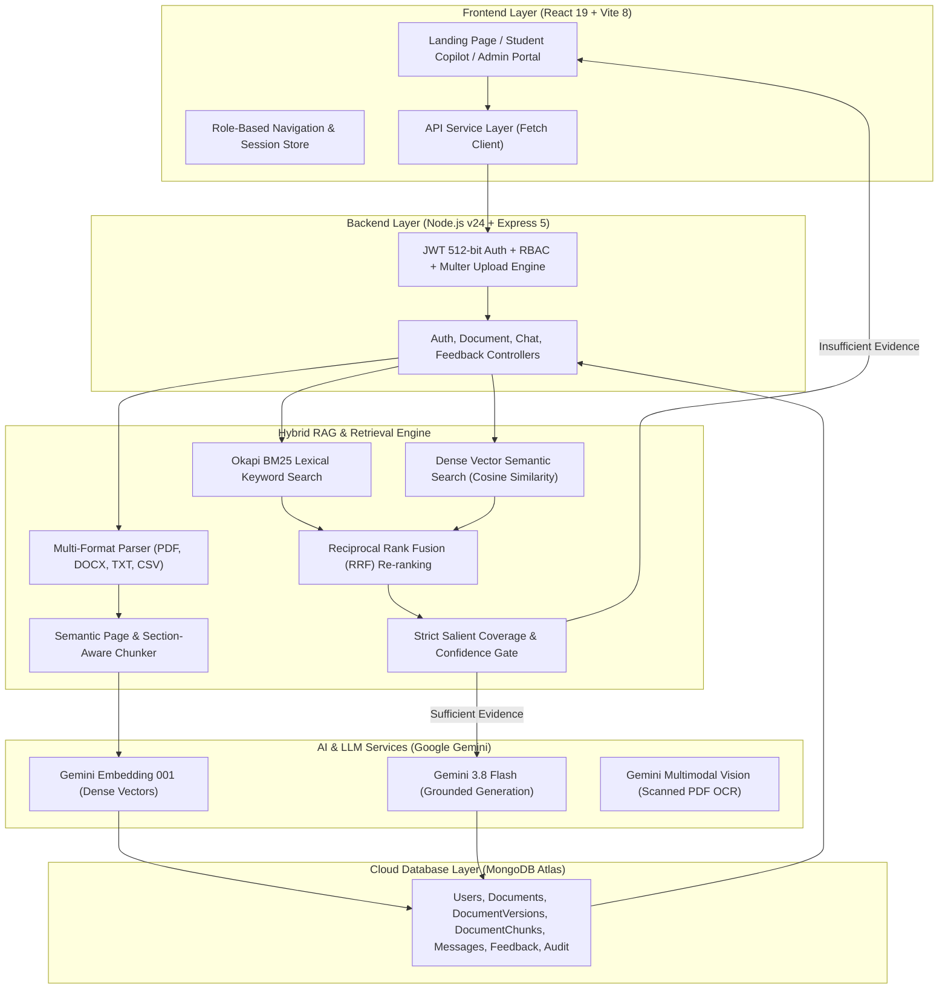

# CampusAI (EDU-02) — Complete Technical Stack & Architecture Specification

> **Project:** EDU-02 — Campus Knowledge Copilot  
> **Core Principle:** *"No Evidence → No Answer"*  
> **Target:** Production-Quality Institution-Specific AI Knowledge Assistant  

---

## 1. Executive Summary

**CampusAI** solves the problem of fragmented institutional knowledge in higher education institutions. Campus policies, examination regulations, attendance rules, curriculum credit structures, placement policies, and scholarships are scattered across disparate documents.

CampusAI provides students and faculty with an AI knowledge copilot that delivers:
1. **Factually Grounded Answers**: Strictly generated from verified campus documents.
2. **Deterministic Source Citations**: Document name, page number, section heading, and confidence score.
3. **Zero Hallucination Guarantee**: Strict abstention (*"Information not found in the institutional knowledge base"*) whenever supporting evidence is insufficient.

---

## 2. High-Level System Architecture



---

## 3. Technology Stack Breakdown

### A. Frontend Layer

| Technology | Version | Purpose & Architecture Details |
| :--- | :---: | :--- |
| **React** | `^19.2.8` | Component-driven single-page application (SPA). Built with modern functional components, hooks (`useState`, `useEffect`, `useRef`), and optimistic state management. |
| **Vite** | `^8.3.3` | Ultra-fast build tool and dev server featuring native ES module imports, Hot Module Replacement (HMR), and tree-shaken rollup builds. |
| **React Router DOM** | `^7.18.4` | Declarative client-side routing supporting role-protected routes (`/`, `/login`, `/register`, `/chat`, `/admin`). |
| **Vanilla CSS** | — | Curated design system adhering to modern dark glassmorphism standards (`#000000`, `#08080a`, `#1c1c20`, `#555ce0`), backdrop blur filters, and fluid layouts. |
| **Lucide React** | `^1.16.0` | Vector icon set for citation badges, document status pills, and user feedback controls. |

### B. Backend Layer

| Technology | Version | Purpose & Architecture Details |
| :--- | :---: | :--- |
| **Node.js** | `v24.13.0` | Event-driven, non-blocking asynchronous runtime managing high-concurrency vector retrieval and streaming I/O. |
| **Express.js** | `^5.2.1` | Minimalist web application framework structuring RESTful controllers, middleware chains, and error handling. |
| **Multer** | `^2.4.0` | Streaming multipart/form-data middleware handling uploads up to 25MB with strict file extension filtering (`.pdf`, `.docx`, `.txt`, `.csv`). |
| **CORS** | `^2.8.6` | Security middleware enabling cross-origin communication between the Vite client and the Express backend. |
| **Dotenv** | `^18.0.5` | Environment variable management isolating credentials (`GEMINI_API_KEY`, `MONGO_URI`, `JWT_SECRET`). |

### C. Database & Cloud Persistence

| Technology | Version | Purpose & Architecture Details |
| :--- | :---: | :--- |
| **MongoDB Atlas** | Cloud v8.0 | High-availability cloud NoSQL database cluster storing user credentials, institutional documents, version trees, chunks, and chat history. |
| **Mongoose ODM** | `^9.11.0` | Object Data Modeling library defining strict data schemas, automatic timestamping, pre-save cryptographic hooks, and compound indexes. |

#### Data Collections & Schemas:
- **`User`**: Account records with role-based access (`student`, `faculty`, `admin`) and bcrypt password hashes.
- **`Document`**: Document metadata, department, category, version numbers, chunk counts, and processing states (`processing`, `indexed`, `failed`).
- **`DocumentVersion`**: Immutable historical audit trail for every replaced document version.
- **`DocumentChunk`**: Granular text blocks indexed with exact `pageNumber`, `section`, `documentTitle`, and dense vector embeddings.
- **`ChatMessage`**: Conversational logs storing questions, grounded responses, citation metadata arrays, confidence scores, and latency.
- **`Feedback` & `AuditLog`**: Captures user helpfulness ratings and institutional compliance audit trails.

### D. Artificial Intelligence & Large Language Models

| Technology / Model | Endpoint / Provider | Purpose & Architecture Details |
| :--- | :--- | :--- |
| **Google Gemini 3.8 Flash** | Google Generative AI | Foundation LLM providing grounded response generation with a low temperature (`0.1`) and strict negative prompt constraints forbidding speculation. |
| **Gemini Embedding 001** | Google Generative AI | High-density 3072-dimensional vector embedding model for document chunks and user search queries. |
| **Gemini Multimodal Vision** | Google Generative AI | Automated OCR transcription engine for scanned or image-only PDFs lacking a digital text layer. |
| **Extractive Grounding Fallback** | Local Rule Engine | Local deterministic synthesis ensuring zero-downtime execution and verified citations even during network or quota interruptions. |

---

## 4. RAG Pipeline Implementation Details

### Step 1: Multi-Format Text Extraction
- **PDF (`pdf-parse ^2.4.5`)**: Extracts digital text page-by-page to retain 1-to-1 physical page numbers.
- **DOCX (`mammoth ^1.13.0`)**: Extracts raw text, headings, and paragraph blocks from Microsoft Word documents.
- **CSV (`csv-parser ^3.2.1`)**: Transforms tabular CSV rows into structured, queryable document pages.
- **Scanned PDFs**: Automatically detected (0 text characters); routed to **Gemini Multimodal Vision** for page-by-page OCR transcription.

### Step 2: Semantic Chunking Engine (`chunker.js`)
- Segments pages into ~250-word chunks with a 35-word overlapping sliding window.
- Retains section titles (`detectSectionTitle`) and exact page numbers on every single chunk.

### Step 3: Hybrid Retrieval (`retrieval.js` & `bm25.js`)
- **Okapi BM25 Lexical Search**: Custom in-memory index with stopword filtering (`what`, `is`, `rule`, `policy`).
- **Dense Vector Search**: Computes Cosine Similarity between the query vector and chunk embeddings.
- **Reciprocal Rank Fusion (RRF)**: Merges vector similarity (55% weight) with BM25 keyword score (45% weight), applying section-match boosts.

### Step 4: Strict Evidence Confidence Gate ("No Evidence → No Answer")
- Evaluates **Salient Keyword Coverage**: If key content words in the question have 0% coverage in candidate chunks, confidence drops to zero.
- If confidence is below threshold (`0.45`), the system bypasses Gemini and immediately triggers the abstention response:  
  `"Information not found in the institutional knowledge base."`

---

## 5. Security & Authentication Architecture

1. **512-bit JWT Cryptography**: Authenticated tokens signed with a 512-bit hex secret key (`jsonwebtoken ^9.0.3`).
2. **Password Salting**: Salted with 10 rounds of bcrypt (`bcryptjs ^3.0.3`) via Mongoose pre-save hooks.
3. **Role-Based Access Control (RBAC)**: Middleware enforcement ensuring normal students cannot access document upload or deletion endpoints.
4. **Key Rotation & Migration Resilience**: Dual-secret verification and email fallback ensuring sessions persist across database or secret updates.
5. **Prompt Injection Hardening**: Context chunks are injected into Gemini as immutable data structures (`[SOURCE X]`), preventing prompt jailbreaks.

---

## 6. Dependencies Reference Table

### Frontend (`package.json`)
```json
{
  "dependencies": {
    "lucide-react": "^1.16.0",
    "react": "^19.2.8",
    "react-dom": "^19.2.8",
    "react-router-dom": "^7.18.4"
  },
  "devDependencies": {
    "@types/react": "^19.2.18",
    "@types/react-dom": "^19.2.7",
    "@vitejs/plugin-react": "^6.1.1",
    "oxlint": "^1.81.0",
    "vite": "^8.3.0"
  }
}
```

### Backend (`Backend/package.json`)
```json
{
  "dependencies": {
    "@google/genai": "^2.27.0",
    "@google/generative-ai": "^0.24.1",
    "bcryptjs": "^3.0.3",
    "cors": "^2.8.6",
    "csv-parser": "^3.2.1",
    "dotenv": "^18.0.5",
    "express": "^5.2.1",
    "jsonwebtoken": "^9.0.3",
    "mammoth": "^1.13.0",
    "mongoose": "^9.11.0",
    "multer": "^2.4.0",
    "nodemon": "^3.1.14",
    "pdf-parse": "^2.4.5"
  }
}
```

---

## 7. REST API Endpoints Specification

| Method | Endpoint | Access | Description |
| :---: | :--- | :---: | :--- |
| `POST` | `/api/auth/register` | Public | Register student or faculty account |
| `POST` | `/api/auth/login` | Public | Authenticate user and issue JWT |
| `GET` | `/api/auth/me` | Authenticated | Fetch current user profile |
| `POST` | `/api/chat` | Authenticated | Execute Hybrid RAG pipeline query with citations |
| `GET` | `/api/chat/sessions` | Authenticated | List previous conversation sessions |
| `GET` | `/api/chat/sessions/:id` | Authenticated | Fetch messages within a specific session |
| `POST` | `/api/feedback` | Authenticated | Submit thumbs up / thumbs down ratings |
| `GET` | `/api/feedback/stats` | Admin | Fetch grounding rate, queries count, and feedback metrics |
| `GET` | `/api/documents` | Authenticated | List all active institutional documents |
| `GET` | `/api/documents/:id` | Authenticated | Fetch document details, versions, and sample chunks |
| `POST` | `/api/documents/upload` | Admin/Faculty | Upload and index institutional document (PDF, DOCX, TXT, CSV) |
| `POST` | `/api/documents/:id/reprocess` | Admin | Retry multimodal OCR and RAG indexing on a document |
| `DELETE` | `/api/documents/:id` | Admin | Delete document and remove all associated vectors from MongoDB |
| `GET` | `/api/health` | Public | Service health status and Gemini configuration check |
